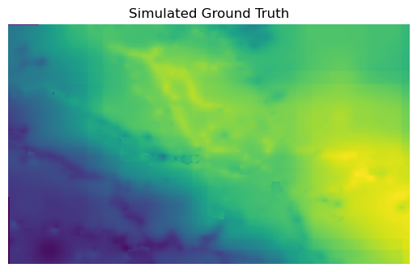
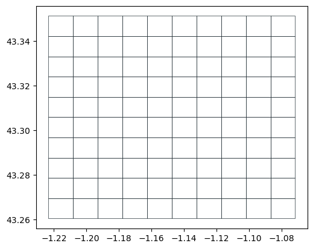
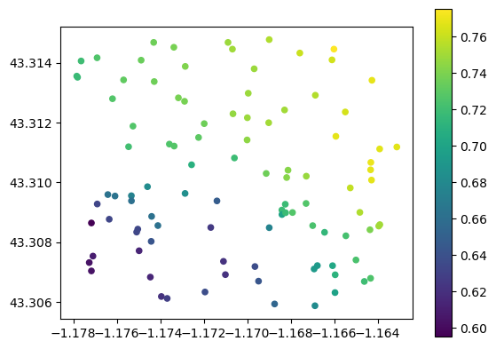
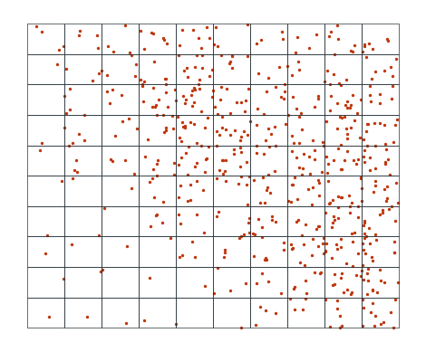
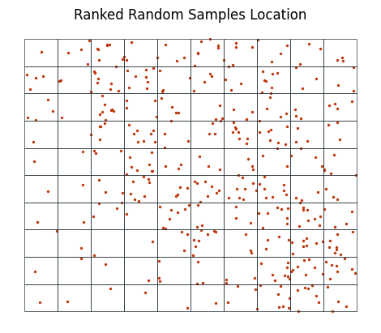
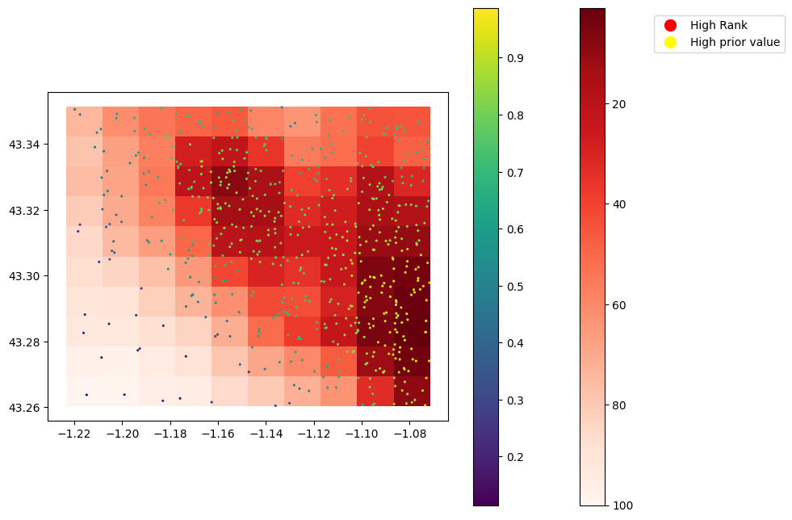
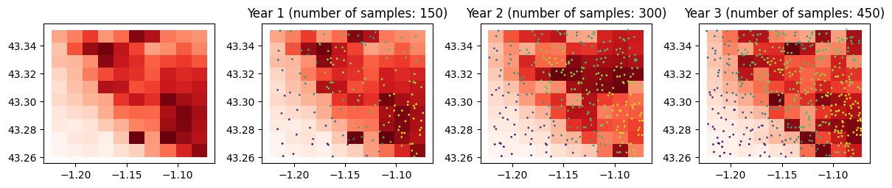

# Trufl

<!-- WARNING: THIS FILE WAS AUTOGENERATED! DO NOT EDIT! -->

**Trufl** was initiated in the context of the [IAEA (International
Atomic Energy Agency)](https://www.iaea.org) Coordinated Research
Project titled [“Monitoring and Predicting Radionuclide Uptake and
Dynamics for Optimizing Remediation of Radioactive Contamination in
Agriculture”](https://www.iaea.org/newscenter/news/new-crp-monitoring-and-predicting-radionuclide-uptake-and-dynamics-for-optimizing-remediation-of-radioactive-contamination-in-agriculture-crp-d15019).

While **Trufl** was originally developed to address the remediation of
farmland affected by nuclear accidents, its approach and algorithms are
**applicable to a wide range of application domains**. This includes
managing **legacy contaminants or monitoring any phenomenon that
requires consideration of multiple decision criteria**, potentially
involving a large set of data.

This package leverages the work done by [Floris
Abrams](https://www.linkedin.com/in/floris-abrams-59080a15a) in the
context of his PhD a collaboration between [SCK
CEN](https://www.sckcen.be) and [KU Leuven](https://www.kuleuven.be) and
[Franck Albinet](https://www.linkedin.com/in/franckalbinet),
International Consultant in Geospatial Data Science and currently PhD
researcher in AI applied to nuclear remedation at KU Leuven.

## Install

`pip install trufl`

## Getting started

In highly sensitive and high-stakes situations, it is **essential that
decision making is informed, transparent, and accountable**, with
decisions being based on a thorough and objective analysis of the
available data and the needs and concerns of affected communities being
taken into account.

Given the time constraints and limited budgets that are often associated
with data surveys (in particular ones supposed to informed highligh
sensitive situation), it is **crucial to make informed decisions about
how to allocate resources**. This is even more important when
considering the many variables that can be taken into account, such as
prior knowledge of the area, health and economic impacts, land use,
whether remediation has already taken place, population density, and
more. Our approach leverages **Multiple-criteria decision-making**
approaches to optimize the data survey workflow:

In this demo, we will walk you through a **typical workflow** using the
`Trufl` package. To help illustrate the process, we will use a “toy”
dataset that represents a typical spatial pattern of soil contaminants.

1.  We **assume that we have access to the ground truth**, which is a
    raster file that shows the spatial distribution of a soil
    contaminant;
2.  We will make decisions about how to optimally sample the
    **administrative units (polygons)**, which in this case are
    **simulated as a grid** (using the `gridder` utilities function);
3.  Based on prior knowledge, such as prior airborne surveys or other
    data, an `Optimizer` will **rank each administrative unit (grid
    cell) according to its priority for sampling**;
4.  We will then **perform random sampling on the designated units (grid
    cells)** (using a `Sampler`). To simulate the measurement process,
    we will use the ground truth to emulate measurements at each
    location (using a `DataCollector`);
5.  We will **evaluate the new state of each unit based on the
    measurements** and **pass it to a new round of optimization**. This
    process will be repeated iteratively to refine the sampling
    strategy.

### Imports

``` python
import matplotlib.pyplot as plt
import matplotlib.lines as mlines

import numpy as np
import pandas as pd
import rasterio
import geopandas as gpd

from trufl.utils import gridder
from trufl.sampler import Sampler, rank_to_sample
from trufl.collector import DataCollector
from trufl.callbacks import (State, MaxCB, MinCB, StdCB, CountCB, MoranICB, PriorCB)
from trufl.optimizer import Optimizer


red, black = '#BF360C', '#263238'
```

### Our simulated ground truth

The assumed ground truth reveals a typical spatial pattern of
contaminant such as `Cs137` after a nuclear accident for instance.

``` python
fname_raster = './files/ground-truth-01-4326-simulated.tif'
with rasterio.open(fname_raster) as src:
    plt.axis('off')
    plt.imshow(src.read(1))
```



### Simulate administrative units

The sampling strategy will be determined on a per-grid-cell basis within
the administrative unit. We define below a 10 x 10 grid over the area of
interest:

``` python
gdf_grid = gridder(fname_raster, nrows=10, ncols=10)
gdf_grid.head()
```

<div>
<style scoped>
    .dataframe tbody tr th:only-of-type {
        vertical-align: middle;
    }
&#10;    .dataframe tbody tr th {
        vertical-align: top;
    }
&#10;    .dataframe thead th {
        text-align: right;
    }
</style>

|        | geometry                                          |
|--------|---------------------------------------------------|
| loc_id |                                                   |
| 0      | POLYGON ((-1.20830 43.26950, -1.20830 43.26042... |
| 1      | POLYGON ((-1.20830 43.27858, -1.20830 43.26950... |
| 2      | POLYGON ((-1.20830 43.28766, -1.20830 43.27858... |
| 3      | POLYGON ((-1.20830 43.29673, -1.20830 43.28766... |
| 4      | POLYGON ((-1.20830 43.30581, -1.20830 43.29673... |

</div>

<div>

> **Tip**
>
> Note how each administrative unit is uniquely identified by its
> `loc_id`.

</div>

``` python
gdf_grid.boundary.plot(color=black, lw=0.5)
plt.axis('off');
```



### What prior knowledge do we have?

At the initial time $t_0$, data sampling has not yet begun, but we can
often **leverage existing prior knowledge of our phenomenon** of
interest to inform our sampling strategy/policy. In the context of
nuclear remediation, this prior knowledge can often be obtained through
mobile surveys, such as airborne or carborne surveys, which can provide
a **coarse estimation** of soil contamination levels.

In the example below, we **simulate prior information about the soil
property of interest by calculating the average value of the property
over each grid cell**.

At this stage, we have no measurements, so we simply create an empty
[Geopandas
GeoDataFrame](https://geopandas.org/en/stable/docs/reference/api/geopandas.GeoDataFrame.html).

``` python
samples_t0 = gpd.GeoDataFrame(index=pd.Index([], name='loc_id'), 
                              geometry=None, data={'value': None})
```

<div>

> **Tip**
>
> We need to set an index `loc_id` and have a `geometry` and `value`
> columns.

</div>

Now we get/“sense” the state of our grid cells based on the simulated
prior (Mean over each grid cell `PriorCB`):

``` python
state = State(samples_t0, gdf_grid, cbs=[PriorCB(fname_raster)])

# You have to call the instance
state_t0 = state(); state_t0.head()
```

<div>
<style scoped>
    .dataframe tbody tr th:only-of-type {
        vertical-align: middle;
    }
&#10;    .dataframe tbody tr th {
        vertical-align: top;
    }
&#10;    .dataframe thead th {
        text-align: right;
    }
</style>

|        | Prior    |
|--------|----------|
| loc_id |          |
| 0      | 0.102492 |
| 1      | 0.125727 |
| 2      | 0.161802 |
| 3      | 0.184432 |
| 4      | 0.201405 |

</div>

<div>

> **Tip**
>
> We get the `Prior` for each individual `loc_id` (here only the first 5
> shown). The current `State` is only composed of a single `PriorCB`
> variable but can include many more variables as we will see below.

</div>

### Optimize sampling based on prior at $t_0$

``` python
# Bugs?
#   - fails when ran twice

benefit_criteria = [True]
optimizer = Optimizer(state=state_t0)
df_rank = optimizer.get_rank(is_benefit_x=benefit_criteria, w_vector = [1],  
                             n_method=None, c_method = None, 
                             w_method=None, s_method="CP")

df_rank.head()
```

<div>
<style scoped>
    .dataframe tbody tr th:only-of-type {
        vertical-align: middle;
    }
&#10;    .dataframe tbody tr th {
        vertical-align: top;
    }
&#10;    .dataframe thead th {
        text-align: right;
    }
</style>

|        | rank |
|--------|------|
| loc_id |      |
| 92     | 1    |
| 93     | 2    |
| 91     | 3    |
| 94     | 4    |
| 82     | 5    |

</div>

``` python
gdf_grid.join(df_rank, how='left').plot(column='rank',
                                        cmap='viridis_r', 
                                        legend_kwds={'label': 'Rank'}, 
                                        legend=True)
plt.axis('off');
```



### Start sampling

<div>

> **Tip**
>
> It’s worth noting that in the absence of any prior knowledge, a
> uniform sampling strategy over the area of interest may be used.
> However, this approach may not be the most efficient use of the
> available data collection and analysis budget.

</div>

Based on the **ranks (sampling priority)** calculated by the `Optimizer`
and given sampling **budget**, let’s calculate the number of samples to
be collected for each administrative unit (`loc_id`). Different sampling
policies can be used (Weighted, quantiles):

``` python
n = rank_to_sample(df_rank['rank'].sort_index().values, 
                   budget=600, min=1, policy="quantiles"); n
```

    array([ 1,  1,  1,  1,  1,  1,  1,  1,  1,  4,  1,  1,  1,  1,  1,  4,  4,
            4,  4,  4,  1,  1,  1,  1,  1,  4,  4,  4,  4,  4,  1,  1,  1,  4,
            4,  7,  7, 12,  7,  7,  1,  1,  4,  4,  7, 12, 12, 12, 12,  7,  1,
            4,  4,  7,  7, 12, 12, 12,  7,  4,  4,  4,  7,  7,  7,  7,  7,  7,
            4,  4,  4,  7, 12,  7, 12, 12,  7,  7,  4,  4,  7, 12, 12, 12, 12,
           12, 12, 12,  7,  7, 12, 12, 12, 12, 12, 12, 12,  7,  7,  7])

We can now decide where to sample based on this sampling schema:

``` python
sampler = Sampler(gdf_grid)
sample_locs_t0 = sampler.sample(n, method='uniform')

print(sample_locs_t0.head())
ax = sample_locs_t0.plot(markersize=2, color=red)

gdf_grid.boundary.plot(color=black, lw=0.5, ax=ax)
plt.axis('off');
```

                             geometry
    loc_id                           
    0       POINT (-1.21488 43.26374)
    1       POINT (-1.20866 43.27508)
    2       POINT (-1.21615 43.28255)
    3       POINT (-1.21561 43.28812)
    4       POINT (-1.20971 43.30413)



### Emulating data collection and analysis

The data collector collects measurements at the random sampling
locations in the field. In our case, we emulate this process by
extracting measurements from the provided raster file.

“Measuring” variable of interest from a given raster:

``` python
dc_emulator = DataCollector(fname_raster)
samples_t0 = dc_emulator.collect(sample_locs_t0)

print(samples_t0.head())
ax = samples_t0.plot(column='value', s=2, legend=True)
gdf_grid.boundary.plot(color=black, lw=0.5, ax=ax);
plt.axis('off');
```

                             geometry     value
    loc_id                                     
    0       POINT (-1.21488 43.26374)  0.114413
    1       POINT (-1.20866 43.27508)  0.124780
    2       POINT (-1.21615 43.28255)  0.174424
    3       POINT (-1.21561 43.28812)  0.177309
    4       POINT (-1.20971 43.30413)  0.247483



### Getting current state

``` python
state = State(samples_t0, gdf_grid, cbs=[
    MaxCB(), MinCB(), StdCB(), CountCB(), MoranICB(k=5), PriorCB(fname_raster)
])

# You have to call the instance
state_t0 = state(); state_t0
```

<div>
<style scoped>
    .dataframe tbody tr th:only-of-type {
        vertical-align: middle;
    }
&#10;    .dataframe tbody tr th {
        vertical-align: top;
    }
&#10;    .dataframe thead th {
        text-align: right;
    }
</style>

|        | Max      | Min      | Standard Deviation | Count | Moran.I  | Prior    |
|--------|----------|----------|--------------------|-------|----------|----------|
| loc_id |          |          |                    |       |          |          |
| 0      | 0.114413 | 0.114413 | 0.000000           | 1     | NaN      | 0.102492 |
| 1      | 0.124780 | 0.124780 | 0.000000           | 1     | NaN      | 0.125727 |
| 2      | 0.174424 | 0.174424 | 0.000000           | 1     | NaN      | 0.161802 |
| 3      | 0.177309 | 0.177309 | 0.000000           | 1     | NaN      | 0.184432 |
| 4      | 0.247483 | 0.247483 | 0.000000           | 1     | NaN      | 0.201405 |
| ...    | ...      | ...      | ...                | ...   | ...      | ...      |
| 95     | 0.893580 | 0.828462 | 0.019361           | 12    | 0.660330 | 0.803670 |
| 96     | 0.839585 | 0.750345 | 0.024869           | 12    | 0.759447 | 0.763408 |
| 97     | 0.751225 | 0.671166 | 0.027414           | 7     | 0.706440 | 0.727797 |
| 98     | 0.704963 | 0.658978 | 0.015093           | 7     | 0.793996 | 0.646002 |
| 99     | 0.709104 | 0.692435 | 0.006180           | 7     | 0.482015 | 0.655185 |

<p>100 rows × 6 columns</p>
</div>

## Determine the ranking of the administrative polygons

Then ranking is based on the importance to sample more in the polygon. A
multi criteria decision aiding methodology is used the rank the parcels
from important to sample more (low rank) less important.

**Criteria** The state of the polygons will be used as criteria to
determine the rank

| Criteria             | State variable | Criteria Type |     |
|----------------------|----------------|---------------|-----|
| Estimated value      | PriorCB()      | Benefit       |     |
| Maximum sample value | MaxCB()        | Benefit       |     |
| Minimal sample value | MinCB()        | Benefit       |     |
| Sample count         | CountCB()      | Cost          |     |
| Standard deviation   | StdCB()        | Benefit       |     |
| Moran I index        | MoranICB(k=5)  | Cost          |     |

**Criteria type** Criteria can be of the type benefit or cost - Benefit
(**high values** equal **high importance** to sample more) - Cost (**low
value** equal **high importance** to sample more)

**Weights** A weight vector is used to determine the importance of
criteria in comparison with each other.

**MCDM techniques** - Compromise programmin (CP) - Distance based
measure, where the distance to the optmal point is used, where low
values relate to good alternatives. - TOPSIS (TOPSIS) - Distance based
measure, where the closeness to the optimal point and anti optimal point
is measured (high values –\> good alternative).

**Rank** Based on the MCDM value a ranking of the polygons is created

<div>

> **Tip**
>
> Start with using equal weights for all the criteria, later you explore
> the impact of changing the weight vector. Make sure the sum of the
> weight vector is 1.

</div>

Ranking of administrative units based on three criteria

``` python
benefit_criteria = [True, True, True]
state = State(samples_t0, gdf_grid, cbs=[MaxCB(), MinCB(), StdCB()])
weight_vector = [0.3, 0.3, 0.4]

optimizer = Optimizer(state=state())
df = optimizer.get_rank(is_benefit_x=benefit_criteria, w_vector = weight_vector,  
                    n_method="LINEAR1", c_method = None, w_method=None, s_method="TOPSIS")

df.head()
```

<div>
<style scoped>
    .dataframe tbody tr th:only-of-type {
        vertical-align: middle;
    }
&#10;    .dataframe tbody tr th {
        vertical-align: top;
    }
&#10;    .dataframe thead th {
        text-align: right;
    }
</style>

|        | rank |
|--------|------|
| loc_id |      |
| 71     | 1    |
| 51     | 2    |
| 38     | 3    |
| 74     | 4    |
| 83     | 5    |

</div>

Based on the ranking of the administrative units an optimized sampling
strategy for $t_1$ can be determined.

``` python
combined_df = gdf_grid.join(df_rank, how='left')
combined_gdf = gpd.GeoDataFrame(combined_df)

fig, ax = plt.subplots(1, 1, figsize=(10, 8))
cax = combined_gdf.plot(column='rank', cmap='Reds_r', legend=True, ax=ax)
samples_t0.plot(column='value', ax=ax, cmap='viridis', s=1.5, legend=True)

cbar = cax.get_figure().get_axes()[1]
cbar.invert_yaxis()

rank_legend = mlines.Line2D([], [], color='Red', marker='o', linestyle='None',
                            markersize=10, label='High Rank')
value_legend = mlines.Line2D([], [], color='Yellow', marker='o', linestyle='None',
                             markersize=10, label='High prior value')

ax.legend(handles=[rank_legend, value_legend], loc='upper left', bbox_to_anchor=(1.5, 1.25))
plt.show()
```



## Multi-year Adaptive sampling approach

- Sampling in year O will done based on the prior
- Sampling in year t will be done based on 6 state variables
  - \[Max value, Min value, Standard deviation, sample count, Moran I,
    Prior value\]
  - \[0.2, 0.1, 0.1, 0.2, 0.2, 0.2\]
- Sampling policy will be based on the point budget and the quantile in
  which the unit ranks 1st: 50 % of point budget 2nd: 30% of point
  budget 3th: 20% of point budget 4th: no extra sample points

``` python
number_of_years = 4
yearly_sample_budget = 150
```

``` python
fig, axs = plt.subplots(1, number_of_years, figsize=(12, 8))  # Adjust figsize as needed
axs = axs.flatten()

sampler = Sampler(gdf_grid)
dc_emulator = DataCollector(fname_raster)

# Samples
samples_t_0 = gpd.GeoDataFrame(index=pd.Index([], name='loc_id'), geometry=None, data={'value': None})
samples_t = []

state = State(samples_t_0, gdf_grid, cbs=[PriorCB(fname_raster)])

# You have to call the instance
state_t0 = state()

benefit_criteria = [True]
optimizer = Optimizer(state=state_t0)
df_rank = optimizer.get_rank(is_benefit_x=benefit_criteria, w_vector = [1],  
                             n_method=None, c_method = None, 
                             w_method=None, s_method="CP")

combined_df = pd.merge(df, gdf_grid[['geometry']], left_index=True, right_index=True, how='inner')
combined_gdf = gpd.GeoDataFrame(combined_df)
combined_gdf.plot(column='rank',cmap='Reds_r', legend_kwds={'label': 'Rank'}, ax = axs[0])

for fig_n, ax in zip(range(1, number_of_years+1), axs[1:]):
    n = rank_to_sample(combined_gdf['rank'].sort_index().values, 
                    budget=yearly_sample_budget, min=1, policy="quantiles")
    sample_locs_t = sampler.sample(n, method='uniform')
    samples = dc_emulator.collect(sample_locs_t)
    try:
        samples_t = pd.concat([samples_t, samples])
    except:
        samples_t = pd.concat([samples])
    
    # plot points versus rank of polygon
    ax = combined_gdf.plot(column='rank', cmap='Reds_r', ax=ax)
    samples_t.plot(column='value', ax=ax, cmap='viridis', s=1)
    ax.title.set_text(f"Year {fig_n} (number of samples: {len(samples_t)})")
    
    # new state
    state = State(samples_t, gdf_grid, cbs=[
        MaxCB(), MinCB(), StdCB(), CountCB(), MoranICB(k=5), PriorCB(fname_raster)])
    
    optimizer = Optimizer(state=state())

    # 2. rank polygons
    benefit_criteria = [True, True, True, False, False, True]
    df = optimizer.get_rank(is_benefit_x=benefit_criteria, w_vector = [0.2, 0.1, 0.1, 0.2, 0.2, 0.2],  n_method="LINEAR1", c_method = None, w_method=None, s_method="CP")

    # 3. map ranking
    combined_df = pd.merge(df, gdf_grid[['geometry']], left_index=True, right_index=True, how='inner')
    combined_gdf = gpd.GeoDataFrame(combined_df)

plt.tight_layout()
plt.show()
```


