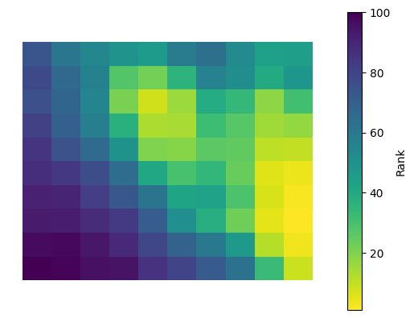

# trufl


<!-- WARNING: THIS FILE WAS AUTOGENERATED! DO NOT EDIT! -->

## Install

``` sh
pip install trufl
```

## How to use

``` python
import matplotlib.pyplot as plt
import numpy as np
import pandas as pd
import rasterio

from trufl.utils import gridder
from trufl.sampler import Sampler
from trufl.callbacks import State, MaxCB, MinCB, StdCB, CountCB, MoranICB


red, black = '#BF360C', '#263238'
```

    The autoreload extension is already loaded. To reload it, use:
      %reload_ext autoreload

### Create a vector grid from a given raster

``` python
fname_raster = '../files/ground-truth-01-4326-simulated.tif'
gdf_grid = gridder(fname_raster, nrows=10, ncols=10)
```

``` python
gdf_grid.head()
```

<div>

<div>
<style scoped>
    .dataframe tbody tr th:only-of-type {
        vertical-align: middle;
    }
&#10;    .dataframe tbody tr th {
        vertical-align: top;
    }
&#10;    .dataframe thead th {
        text-align: right;
    }
</style>

|     | loc_id | geometry                                          |
|-----|--------|---------------------------------------------------|
| 0   | 0      | POLYGON ((-1.20830 43.26950, -1.20830 43.26042... |
| 1   | 1      | POLYGON ((-1.20830 43.27858, -1.20830 43.26950... |
| 2   | 2      | POLYGON ((-1.20830 43.28766, -1.20830 43.27858... |
| 3   | 3      | POLYGON ((-1.20830 43.29673, -1.20830 43.28766... |
| 4   | 4      | POLYGON ((-1.20830 43.30581, -1.20830 43.29673... |

</div>

</div>

``` python
gdf_grid.boundary.plot(color=black, lw=0.5)
```


### Emulating data collection

#### Random sample

Generating a random set of points within a given polygon geoseries.

``` python
loc_id = 35
n_pts = 100
sampling_locs = gdf_grid.loc[gdf_grid.loc_id == loc_id].sample_points(n_pts)
sampling_locs.plot(markersize=3, color=red)
```


``` python
sampling_locs
```

    35    MULTIPOINT ((-1.17784 43.31355), (-1.17780 43....
    Name: sampled_points, dtype: geometry

#### Emulate data collection

We will simulate a data collection process over a set of areas, which
could be administrative units or a gridded version of them. For each
area, we will specify the number of measurements to be taken, which we
will simulate by generating random numbers between 1 and 100.

For each area, we will follow the following steps:

- **Generate random sample locations**: we will create a set of random
  coordinates within the bounds of the area, where we will simulate the
  collection of data.
- **Emulate measurement data**: for each sample location, we will
  extract the corresponding value from a given raster dataset, which we
  will use to simulate the actual measurement.

This iterative process will allow us to generate a simulated dataset of
measurements, which we can then use for further analysis and modeling.

We will emulate data collection from the raster shown below:

``` python
with rasterio.open(fname_raster) as src:
    plt.axis('off')
    plt.imshow(src.read(1))
```


Let’s start with a single area as an example:

``` python
sampler = Sampler(fname_raster)
gdf_samples = sampler.sample(sampling_locs)
gdf_samples.plot(column='value', s=20, legend=True);
```



``` python
gdf_samples.head()
```

<div>

<div>
<style scoped>
    .dataframe tbody tr th:only-of-type {
        vertical-align: middle;
    }
&#10;    .dataframe tbody tr th {
        vertical-align: top;
    }
&#10;    .dataframe thead th {
        text-align: right;
    }
</style>

|     | loc_id | geometry                  | value    |
|-----|--------|---------------------------|----------|
| 0   | 35     | POINT (-1.17784 43.31355) | 0.716917 |
| 1   | 35     | POINT (-1.17780 43.31351) | 0.716917 |
| 2   | 35     | POINT (-1.17764 43.31405) | 0.719065 |
| 3   | 35     | POINT (-1.17727 43.30731) | 0.603759 |
| 4   | 35     | POINT (-1.17717 43.30703) | 0.603759 |

</div>

</div>

Than for all areas iteratively:

``` python
sampler = Sampler(fname_raster)
n_planned = np.random.randint(1, high=100, size=len(gdf_grid), dtype=int)
loc_ids = gdf_grid.loc_id.values

samples_t0 = []
for loc_id, n in zip(loc_ids, n_planned):    
    sampling_locs = gdf_grid.loc[gdf_grid.loc_id == loc_id].sample_points(n)
    gdf_samples = sampler.sample(sampling_locs)
    samples_t0.append(gdf_samples)

gdf_samples_t0 = pd.concat(samples_t0)
```

``` python
gdf_samples_t0.head()
```

<div>

<div>
<style scoped>
    .dataframe tbody tr th:only-of-type {
        vertical-align: middle;
    }
&#10;    .dataframe tbody tr th {
        vertical-align: top;
    }
&#10;    .dataframe thead th {
        text-align: right;
    }
</style>

|     | loc_id | geometry                  | value    |
|-----|--------|---------------------------|----------|
| 0   | 0      | POINT (-1.22295 43.26252) | 0.135936 |
| 1   | 0      | POINT (-1.22287 43.26682) | 0.124077 |
| 2   | 0      | POINT (-1.22284 43.26526) | 0.138138 |
| 3   | 0      | POINT (-1.22269 43.26871) | 0.089607 |
| 4   | 0      | POINT (-1.22262 43.26560) | 0.138138 |

</div>

</div>

``` python
ax = gdf_samples_t0.plot(column='value', s=1.5, legend=True)
gdf_grid.boundary.plot(color=black, ax=ax);
```


### Getting current state

``` python
state = State(gdf_samples_t0, [MaxCB(), MinCB(), StdCB(), CountCB(), MoranICB(k=5)])
```

``` python
state.get(loc_id=2, as_numpy=True)
```

    (array(['Max', 'Min', 'Standard Deviation', 'Count', 'Moran.I',
            'Moran_p_sim'], dtype='<U18'),
     array([1.75537333e-01, 1.56651393e-01, 6.98050205e-03, 1.10000000e+01,
            7.69166175e-01, 1.00000000e-03]))

``` python
state.get(loc_id=2, as_numpy=False)
```

    [Variable(name='Max', value=0.17553733),
     Variable(name='Min', value=0.1566514),
     Variable(name='Standard Deviation', value=0.006980502),
     Variable(name='Count', value=11),
     Variable(name='Moran.I', value=0.7691661745810014),
     Variable(name='Moran_p_sim', value=0.001)]
